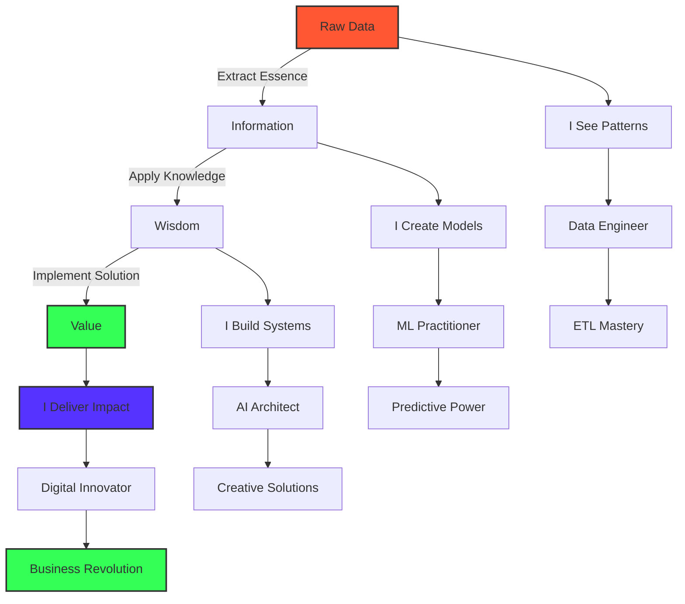

<div align="center">
  
</div>

<div align="center">
  <h3>
    <code>{ while(alive) { learn(); create(); share(); } }</code>
  </h3>
</div>

# ⚡ Forging Digital Intelligence From Raw Data Chaos ⚡

<div align="center">
  <a href="https://github.com/dheeraz07">
    
  </a>
</div>

[](https://www.linkedin.com/in/dheerazchavali/)
[](mailto:dheerazchavali@gmail.com)
[](https://leetcode.com/Dheeraz7/)
[](https://www.hackerrank.com/dheerazchavali)

## 🧙‍♂️ The Digital Alchemist's Manifesto

I don't just write code—I sculpt digital ecosystems where data flows like water, transforms like fire, and yields insights solid as earth. At the intersection of bits and neurons, I craft intelligent systems that blur the line between human intuition and machine precision.

```python
class Dheeraz(DataAlchemist):
    def __init__(self):
        self.mission = "Transmuting raw data into digital gold"
        self.powers = ["Pattern recognition", "System architecture", "AI conjuring"]
        self.motto = "In a world of 0s and 1s, I find the hidden 2s"
    
    def approach_problem(self, challenge):
        visualize_end_state(challenge)
        decode_underlying_patterns(challenge)
        architect_elegant_solution(challenge)
        implement_with_craftsmanship(challenge)
        return revolutionary_outcome(challenge)
    
    def daily_mantra(self):
        print("I don't predict the future. I build it.")
```

When data tsunamis overwhelm others, I'm building arks of algorithms. Where complexity creates chaos, I weave order through elegant architecture. I don't just follow the digital revolution—I'm engineering its next evolution.

<div align="center">
  
</div>

## 🔮 Where Imagination Meets Implementation

In my world, AI isn't just artificial intelligence—it's augmented imagination. Data pipelines aren't just workflows—they're digital nervous systems carrying the lifeblood of insights across the enterprise body.

I turn:
- 📊 Spreadsheet nightmares into dream dashboards that tell stories
- 🧩 Fragmented data sources into unified knowledge oceans
- 🤖 Static algorithms into learning entities that evolve with every byte
- 🌪️ Chaotic business problems into structured, solvable equations

<div align="center">

### 🛠️ Arsenal of Digital Transmutation

[](https://aws.amazon.com/)
[](https://azure.microsoft.com/)
[](https://spark.apache.org/)
[](https://kafka.apache.org/)
[](https://hadoop.apache.org/)
[](https://cloud.google.com/bigquery)
[](https://databricks.com/)
[](https://aws.amazon.com/sagemaker/)

### Data Science & Analytics
[](https://numpy.org/)
[](https://pandas.pydata.org/)
[](https://matplotlib.org/)
[](https://seaborn.pydata.org/)
[](https://jupyter.org/)
[](https://www.python.org/)

### Machine Learning & Deep Learning
[](https://scikit-learn.org/)
[](https://www.tensorflow.org/)
[](https://keras.io/)
[](https://pytorch.org/)
[](https://xgboost.ai/)
[](https://openai.com/)

### AI & LLMs
[](https://openai.com/)
[](https://huggingface.co/)
[](https://langchain.com/)
[](https://www.llamaindex.ai/)
[](https://en.wikipedia.org/wiki/Retrieval-augmented_generation)
[](https://spacy.io/)
[](https://openai.com/)
[](https://www.elastic.co/)
[](https://openai.com/)
[](https://openai.com/)

</div>

## 🧠 The Neural Architecture of Mastery



## 🚀 Chronicles of Digital Transformation

### [Finnhub Trading Data Streaming Pipeline](https://github.com/dheeraz07/Finnhub-trading-Data-Streaming-Pipeline)
Crafted a real-time neural system for financial markets that processes trading heartbeats through Kafka arteries and Spark neurons, transforming market noise into trading symphonies.

### [Anomaly Detection for Transactions and Network Logs](https://github.com/dheeraz07/Anomaly-Detection-in-Transactions-and-Netflow-logs)
Forged digital guardians that stand vigilant against the shadows of fraud and cyber threats, using advanced ML sentinels to distinguish normal patterns from malicious anomalies.

### [Amazon Connect Real-time Transcription](https://github.com/dheeraz07/Amazon-Connect-Real-time-Transcription)
Built digital ears that listen, understand, and translate human conversations into actionable text streams, giving voice to customer data through AWS's transcription alchemy.

### [Spotify Data Pipeline Using AWS](https://github.com/dheeraz07/Spotify-Data-Pipeline-Using-AWS)
Orchestrated a harmonious data symphony that captures the rhythm of music streaming, transforming scattered notes of user behavior into melodious insights.

### [Uber Expense Tracking with Apache Airflow](https://github.com/dheeraz07/Tracking-Uber-expenses-using-Apache-Airflow)
Conducted an automated financial concerto with Airflow as the maestro, directing the precise flow of expense data from raw receipts to visualization crescendos.

## ✨ The Code Whisperer's Stats

<div align="center">
  
  
</div>

## 🔥 Let's Conjure Digital Magic Together

I don't just solve problems—I hunt them with relentless curiosity. I don't just build systems—I craft digital cathedrals where data finds its highest purpose. If you seek a digital sorcerer who turns business challenges into technological marvels, let's connect and rewrite what's possible.

> "In the realm where data meets imagination, that's where you'll find me—crafting the impossible into reality, one algorithm at a time."

📬 Summon me: [dheerazchavali@gmail.com](mailto:dheerazchavali@gmail.com)