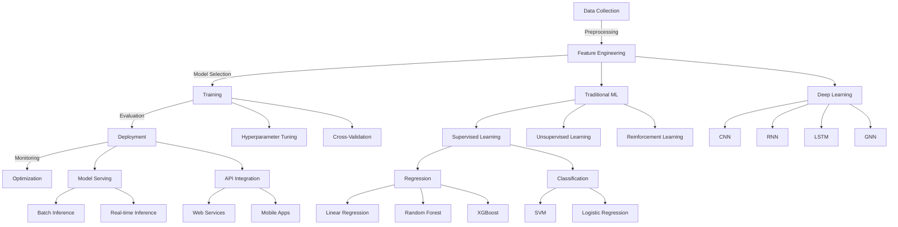
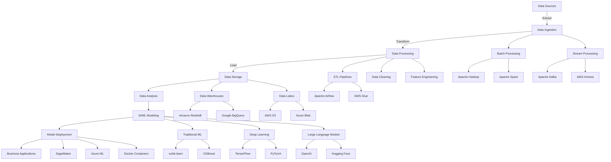

# Shanmukha Sai Dheeraz Chavali | Data Engineer & AI Enthusiast

## About Me

Experienced Data Engineer and ML practitioner specializing in cloud-native data solutions, machine learning systems, and AI applications. I design and implement scalable data pipelines, real-time analytics platforms, and intelligent systems that transform raw data into actionable insights.

My expertise spans the full data science lifecycle, from data acquisition and processing to advanced analytics, machine learning model development, and AI integration. I'm passionate about solving complex data challenges and building robust, efficient systems that drive business value.

## 🛠️ Technical Arsenal

### Programming Languages & Core Libraries

### Data Science & Analytics

### Machine Learning & Deep Learning

### AI & LLMs

### Cloud & Big Data

### Data Engineering & ETL

### Visualization & Reporting

### DevOps & Tools

### Machine Learning & AI Expertise

### Data & AI Engineering Workflow

## Featured Projects

### [Finnhub Trading Data Streaming Pipeline](https://github.com/dheeraz07/Finnhub-trading-Data-Streaming-Pipeline)
Real-time streaming pipeline processing financial market data from Finnhub.io API using Apache Kafka and Spark for high-throughput, low-latency data processing.

### [Anomaly Detection for Transactions and Network Logs](https://github.com/dheeraz07/Anomaly-Detection-in-Transactions-and-Netflow-logs)
Cloud Dataflow streaming pipelines leveraging BigQuery ML and Cloud AI Platform to detect anomalies in real-time for cybersecurity and fraud detection.

### [Amazon Connect Real-time Transcription](https://github.com/dheeraz07/Amazon-Connect-Real-time-Transcription)
Implemented live customer audio transcription for Amazon Connect using Amazon Kinesis Video Streams and Amazon Transcribe.

### [Spotify Data Pipeline Using AWS](https://github.com/dheeraz07/Spotify-Data-Pipeline-Using-AWS)
End-to-end data pipeline extracting, transforming, and loading data from Spotify API into AWS storage services for analytics.

### [Uber Expense Tracking with Apache Airflow](https://github.com/dheeraz07/Tracking-Uber-expenses-using-Apache-Airflow)
ETL pipeline built with Apache Airflow and AWS Redshift for processing and visualizing Uber expense data.

## GitHub Stats

## Let's Connect
I'm always open to interesting conversations and opportunities. Feel free to reach out to me at dheerazchavali@gmail.com.