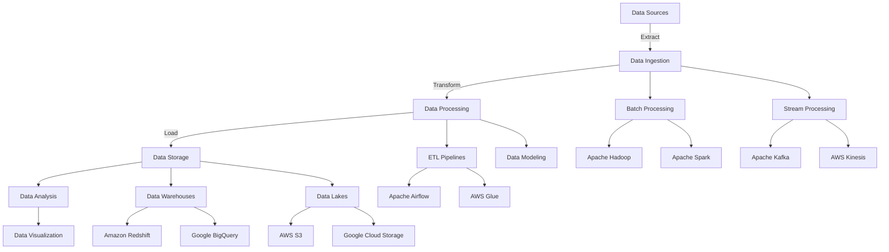

# Shanmukha Sai Dheeraz Chavali | Data Engineer

## About Me

Experienced Data Engineer specializing in cloud-native data solutions and big data architectures. I design and implement scalable data pipelines, real-time streaming systems, and analytics platforms that transform raw data into actionable insights.

My expertise spans the full data engineering lifecycle, from data acquisition and processing to storage, analysis, and visualization. I'm passionate about solving complex data challenges and building robust, efficient systems that drive business value.

## 🛠️ Technical Arsenal

### Cloud & Infrastructure

### Data Processing & Storage

### Databases & Data Warehousing

### Programming & Scripting

### Visualization & Reporting

### Data Engineering Expertise

## Featured Projects

### [Finnhub Trading Data Streaming Pipeline](https://github.com/dheeraz07/Finnhub-trading-Data-Streaming-Pipeline)
Real-time streaming pipeline processing financial market data from Finnhub.io API using Apache Kafka and Spark for high-throughput, low-latency data processing.

### [Anomaly Detection for Transactions and Network Logs](https://github.com/dheeraz07/Anomaly-Detection-in-Transactions-and-Netflow-logs)
Cloud Dataflow streaming pipelines leveraging BigQuery ML and Cloud AI Platform to detect anomalies in real-time for cybersecurity and fraud detection.

### [Amazon Connect Real-time Transcription](https://github.com/dheeraz07/Amazon-Connect-Real-time-Transcription)
Implemented live customer audio transcription for Amazon Connect using Amazon Kinesis Video Streams and Amazon Transcribe.

### [Spotify Data Pipeline Using AWS](https://github.com/dheeraz07/Spotify-Data-Pipeline-Using-AWS)
End-to-end data pipeline extracting, transforming, and loading data from Spotify API into AWS storage services for analytics.

### [Uber Expense Tracking with Apache Airflow](https://github.com/dheeraz07/Tracking-Uber-expenses-using-Apache-Airflow)
ETL pipeline built with Apache Airflow and AWS Redshift for processing and visualizing Uber expense data.

## GitHub Stats

## Let's Connect
I'm always open to interesting conversations and opportunities. Feel free to reach out to me at dheerazchavali@gmail.com.