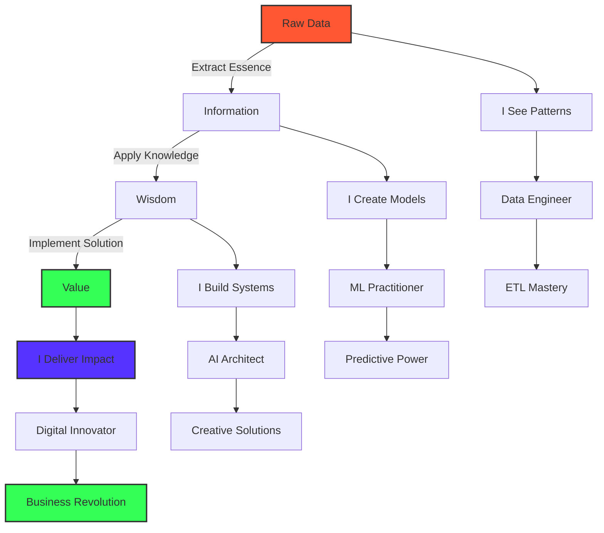

<div align="center">
  
</div>

<div align="center">
  <h3>
    <code>{ while(alive) { learn(); create(); share(); } }</code>
  </h3>
</div>

# ⚡ Forging Digital Intelligence From Raw Data Chaos ⚡

<div align="center">
  <a href="https://github.com/dheeraz07">
    
  </a>
</div>

[](https://www.linkedin.com/in/dheerazchavali/)
[](mailto:dheerazchavali@gmail.com)
[](https://leetcode.com/Dheeraz7/)
[](https://www.hackerrank.com/dheerazchavali)

## 🧙‍♂️ The Digital Alchemist's Manifesto

I don't just write code—I sculpt digital ecosystems where data flows like water, transforms like fire, and yields insights solid as earth. At the intersection of bits and neurons, I craft intelligent systems that blur the line between human intuition and machine precision.

```python
class Dheeraz(DataAlchemist):
    def __init__(self):
        self.mission = "Transmuting raw data into digital gold"
        self.powers = ["Pattern recognition", "System architecture", "AI conjuring"]
        self.motto = "In a world of 0s and 1s, I find the hidden 2s"
    
    def approach_problem(self, challenge):
        visualize_end_state(challenge)
        decode_underlying_patterns(challenge)
        architect_elegant_solution(challenge)
        implement_with_craftsmanship(challenge)
        return revolutionary_outcome(challenge)
    
    def daily_mantra(self):
        print("I don't predict the future. I build it.")
```

When data tsunamis overwhelm others, I'm building arks of algorithms. Where complexity creates chaos, I weave order through elegant architecture. I don't just follow the digital revolution—I'm engineering its next evolution.

<div align="center">
  
</div>

## 🔮 Where Imagination Meets Implementation

In my world, AI isn't just artificial intelligence—it's augmented imagination. Data pipelines aren't just workflows—they're digital nervous systems carrying the lifeblood of insights across the enterprise body.

I turn:
- 📊 Spreadsheet nightmares into dream dashboards that tell stories
- 🧩 Fragmented data sources into unified knowledge oceans
- 🤖 Static algorithms into learning entities that evolve with every byte
- 🌪️ Chaotic business problems into structured, solvable equations

<div align="center">
  <h2>🌌 COSMIC TECH ARSENAL 🌌</h2>
  <i>Navigate my universe of skills where each constellation represents mastery</i>
</div>

<br>

```
                     .                    .                      +                       .
                                   _     .                  .             .
  .             .                 / \         .    + .                         
            +                    | P |    .           .     .    .            .          .
                          *      | Y |         .                     .
      .                          | T |    .          .            .
         .         .       .    | H |                      .                  .          .
                               | O |          .                   .
           .                   | N |                .                          .       
                 .             \___/     .                      .
     .                            .               .                           .         +
           .                           .    * .                    .
               .               .                          .                     .
       .             +--------------+          .                         .  
                    |              |                             .                       .
          .         | TENSORFLOW   |     .                                     
                    |              |                 .                 +
       .            +--------------+       .                                            .
              .          |     |          .                      .
                  .      |     |                                                        .
       .     ┌───────────┘     └────────────┐      .                  .
            ┌┘                              └┐             +                  .
       .   ┌┘                                └┐                                     .
          ┌┘                                  └┐       .                     
      .  ┌┘                                    └┐                                      .
        ┌┘                                      └┐              .
       ┌┘                                        └┐                           .
     .└─────────────────────────────────────────┘                                 
```

<div align="center">
  <h3>💫 DATA UNIVERSE NAVIGATION MAP 💫</h3>
</div>

<table align="center" border="0">
<tr>
<td width="33%" align="center">
<h3>🔭 DATA OBSERVATORY</h3>


<br>
<code>Python • Pandas • NumPy • SQL</code><br>
<code>ETL • Data Mining • Matplotlib</code><br>
<code>Seaborn • A/B Testing • OOP</code>
<p><i>Where raw data is observed, collected, and prepared for its journey</i></p>
</td>
<td width="33%" align="center">
<h3>🚀 QUANTUM ENGINE ROOM</h3>


<br>
<code>TensorFlow • PyTorch • Keras</code><br>
<code>Scikit-learn • XGBoost</code><br>
<code>Deep Learning • Neural Networks</code>
<p><i>The powerhouse where algorithms transform data into predictive models</i></p>
</td>
<td width="33%" align="center">
<h3>👁️ AI VISION DECK</h3>


<br>
<code>LLMs • RAG • LangChain</code><br>
<code>LlamaIndex • Vector Search</code><br>
<code>Prompt Engineering • spaCy</code>
<p><i>Where next-generation AI systems are designed and deployed</i></p>
</td>
</tr>
<tr>
<td width="33%" align="center">
<h3>☁️ CLOUD COMMAND CENTER</h3>


<br>
<code>AWS • Azure • GCP</code><br>
<code>SageMaker • Lambda • EC2</code><br>
<code>S3 • Redshift • BigQuery</code>
<p><i>The control room orchestrating cloud resources and infrastructure</i></p>
</td>
<td width="33%" align="center">
<h3>🌊 DATA STREAM NEXUS</h3>


<br>
<code>Spark • Hadoop • Kafka</code><br>
<code>Databricks • EMR • Hive</code><br>
<code>Data Lakes • Streaming</code>
<p><i>Where massive data streams converge and flow through the system</i></p>
</td>
<td width="33%" align="center">
<h3>🧪 INNOVATION LAB</h3>


<br>
<code>Docker • Kubernetes • Git</code><br>
<code>MLOps • CI/CD • PostgreSQL</code><br>
<code>NoSQL • MongoDB • Redis</code>
<p><i>Experimental chamber where new technologies are tested and integrated</i></p>
</td>
</tr>
</table>

<div align="center">
  <h3>🌠 SKILL SUPERNOVA 🌠</h3>
  <p><i>An explosion of technologies in my expanding universe</i></p>
</div>

<div align="center" style="display: flex; flex-wrap: wrap; justify-content: center; gap: 8px; margin: 20px 0;">
<!-- Programming Languages -->
<span style="background: linear-gradient(135deg, #3776AB 0%, #1D4F73 100%); color: white; padding: 5px 12px; border-radius: 20px; font-size: 12px; margin: 4px;">Python</span>
<span style="background: linear-gradient(135deg, #FF7800 0%, #C75000 100%); color: white; padding: 5px 12px; border-radius: 20px; font-size: 12px; margin: 4px;">SQL</span>
<span style="background: linear-gradient(135deg, #F7DF1E 0%, #C7B200 100%); color: black; padding: 5px 12px; border-radius: 20px; font-size: 12px; margin: 4px;">JavaScript</span>
<span style="background: linear-gradient(135deg, #00599C 0%, #003566 100%); color: white; padding: 5px 12px; border-radius: 20px; font-size: 12px; margin: 4px;">C++</span>
<span style="background: linear-gradient(135deg, #B07219 0%, #804000 100%); color: white; padding: 5px 12px; border-radius: 20px; font-size: 12px; margin: 4px;">Java</span>

<!-- Data Science -->
<span style="background: linear-gradient(135deg, #150458 0%, #0C0233 100%); color: white; padding: 5px 12px; border-radius: 20px; font-size: 12px; margin: 4px;">Pandas</span>
<span style="background: linear-gradient(135deg, #013243 0%, #001824 100%); color: white; padding: 5px 12px; border-radius: 20px; font-size: 12px; margin: 4px;">NumPy</span>
<span style="background: linear-gradient(135deg, #11557C 0%, #0A3F5C 100%); color: white; padding: 5px 12px; border-radius: 20px; font-size: 12px; margin: 4px;">Matplotlib</span>
<span style="background: linear-gradient(135deg, #3776AB 0%, #1D4F73 100%); color: white; padding: 5px 12px; border-radius: 20px; font-size: 12px; margin: 4px;">Seaborn</span>
<span style="background: linear-gradient(135deg, #F7931E 0%, #C75000 100%); color: white; padding: 5px 12px; border-radius: 20px; font-size: 12px; margin: 4px;">A/B Testing</span>
<span style="background: linear-gradient(135deg, #3C873A 0%, #265E25 100%); color: white; padding: 5px 12px; border-radius: 20px; font-size: 12px; margin: 4px;">OOP</span>

<!-- Machine Learning -->
<span style="background: linear-gradient(135deg, #F7931E 0%, #C75000 100%); color: white; padding: 5px 12px; border-radius: 20px; font-size: 12px; margin: 4px;">Scikit-learn</span>
<span style="background: linear-gradient(135deg, #FF6F00 0%, #C75000 100%); color: white; padding: 5px 12px; border-radius: 20px; font-size: 12px; margin: 4px;">TensorFlow</span>
<span style="background: linear-gradient(135deg, #D00000 0%, #9A0000 100%); color: white; padding: 5px 12px; border-radius: 20px; font-size: 12px; margin: 4px;">Keras</span>
<span style="background: linear-gradient(135deg, #EE4C2C 0%, #B73C24 100%); color: white; padding: 5px 12px; border-radius: 20px; font-size: 12px; margin: 4px;">PyTorch</span>
<span style="background: linear-gradient(135deg, #006ACC 0%, #004F99 100%); color: white; padding: 5px 12px; border-radius: 20px; font-size: 12px; margin: 4px;">XGBoost</span>
<span style="background: linear-gradient(135deg, #5C3EE8 0%, #412CB3 100%); color: white; padding: 5px 12px; border-radius: 20px; font-size: 12px; margin: 4px;">Deep Learning</span>

<!-- AI & LLMs -->
<span style="background: linear-gradient(135deg, #412991 0%, #2C1D66 100%); color: white; padding: 5px 12px; border-radius: 20px; font-size: 12px; margin: 4px;">OpenAI</span>
<span style="background: linear-gradient(135deg, #FF9A00 0%, #C75000 100%); color: white; padding: 5px 12px; border-radius: 20px; font-size: 12px; margin: 4px;">Hugging Face</span>
<span style="background: linear-gradient(135deg, #3178C6 0%, #1D4F73 100%); color: white; padding: 5px 12px; border-radius: 20px; font-size: 12px; margin: 4px;">LangChain</span>
<span style="background: linear-gradient(135deg, #0467DF 0%, #03499C 100%); color: white; padding: 5px 12px; border-radius: 20px; font-size: 12px; margin: 4px;">LlamaIndex</span>
<span style="background: linear-gradient(135deg, #FF4F8B 0%, #C73F6B 100%); color: white; padding: 5px 12px; border-radius: 20px; font-size: 12px; margin: 4px;">RAG</span>
<span style="background: linear-gradient(135deg, #09A3D5 0%, #077FA3 100%); color: white; padding: 5px 12px; border-radius: 20px; font-size: 12px; margin: 4px;">spaCy</span>
<span style="background: linear-gradient(135deg, #FF6F61 0%, #C75048 100%); color: white; padding: 5px 12px; border-radius: 20px; font-size: 12px; margin: 4px;">Prompt Engineering</span>
<span style="background: linear-gradient(135deg, #5C5C5C 0%, #3D3D3D 100%); color: white; padding: 5px 12px; border-radius: 20px; font-size: 12px; margin: 4px;">Vector Search</span>
<span style="background: linear-gradient(135deg, #8A2BE2 0%, #5F1E9C 100%); color: white; padding: 5px 12px; border-radius: 20px; font-size: 12px; margin: 4px;">Generative AI</span>
<span style="background: linear-gradient(135deg, #00B8D9 0%, #008DAA 100%); color: white; padding: 5px 12px; border-radius: 20px; font-size: 12px; margin: 4px;">LLMs</span>

<!-- Cloud & Big Data -->
<span style="background: linear-gradient(135deg, #232F3E 0%, #131B23 100%); color: white; padding: 5px 12px; border-radius: 20px; font-size: 12px; margin: 4px;">AWS</span>
<span style="background: linear-gradient(135deg, #0078D4 0%, #005B9F 100%); color: white; padding: 5px 12px; border-radius: 20px; font-size: 12px; margin: 4px;">Azure</span>
<span style="background: linear-gradient(135deg, #4285F4 0%, #2D62CC 100%); color: white; padding: 5px 12px; border-radius: 20px; font-size: 12px; margin: 4px;">BigQuery</span>
<span style="background: linear-gradient(135deg, #FF3621 0%, #C72817 100%); color: white; padding: 5px 12px; border-radius: 20px; font-size: 12px; margin: 4px;">Databricks</span>
<span style="background: linear-gradient(135deg, #FF9900 0%, #C75000 100%); color: white; padding: 5px 12px; border-radius: 20px; font-size: 12px; margin: 4px;">SageMaker</span>
<span style="background: linear-gradient(135deg, #E25A1C 0%, #B34513 100%); color: white; padding: 5px 12px; border-radius: 20px; font-size: 12px; margin: 4px;">Spark</span>
<span style="background: linear-gradient(135deg, #231F20 0%, #151111 100%); color: white; padding: 5px 12px; border-radius: 20px; font-size: 12px; margin: 4px;">Kafka</span>
<span style="background: linear-gradient(135deg, #66CCFF 0%, #419CD9 100%); color: black; padding: 5px 12px; border-radius: 20px; font-size: 12px; margin: 4px;">Hadoop</span>
</div>

<div align="center">
  <h3>🎮 SKILL POWER METER 🎮</h3>
</div>

```
PYTHON         [█████████████████████████] 100%
DATA SCIENCE   [████████████████████████▏]  98%
MACHINE LEARN  [██████████████████████▏  ]  90%
BIG DATA       [████████████████████▏    ]  85%
CLOUD          [██████████████████▏      ]  80%
AI/LLMs        [████████████████▏        ]  75%
DATABASES      [████████████████▏        ]  75%
DEVOPS         [████████████▏            ]  60%
```

<div align="center">
  <h3>🧬 SKILLSET DNA SEQUENCE 🧬</h3>
</div>

```
A-T-G-C-A-T-G-C-A-T-G-C-A-T-G-C-A-T-G-C-A-T-G-C-A-T-G-C-A-T-G-C-A-T-G-C-A-T-G-C
|   |   |   |   |   |   |   |   |   |   |   |   |   |   |   |   |   |   |   |
P   A   N   D   A   S   T   E   N   S   O   R   F   L   O   W   A   W   S   S
Y   /   U   A   /   P   F   T   N   C   P   A   L   L   P   E   Z   S   A   A
T   B   M   T   B   A   |   L   |   I   E   G   |   M   E   B   U   |   G   |
H   |   P   A   |   R   |   |   |   K   N   |   |   s   N   |   R   |   E   |
O   T   Y   |   T   K   |   |   |   I   A   |   |   |   A   |   E   |   M   |
N   E   |   |   E   |   |   |   |   T   I   |   |   |   I   |   |   |   A   |
|   S   |   |   S   |   |   |   |   |   |   |   |   |   |   |   |   |   K   |
|   T   |   |   T   |   |   |   |   |   |   |   |   |   |   |   |   |   E   |
|   I   |   |   I   |   |   |   |   |   |   |   |   |   |   |   |   |   R   |
|   N   |   |   N   |   |   |   |   |   |   |   |   |   |   |   |   |   |   |
|   G   |   |   G   |   |   |   |   |   |   |   |   |   |   |   |   |   |   |
G-C-T-A-G-C-T-A-G-C-T-A-G-C-T-A-G-C-T-A-G-C-T-A-G-C-T-A-G-C-T-A-G-C-T-A-G-C-T
```

## 🧠 The Neural Architecture of Mastery



## 🚀 Chronicles of Digital Transformation

### [Finnhub Trading Data Streaming Pipeline](https://github.com/dheeraz07/Finnhub-trading-Data-Streaming-Pipeline)
Crafted a real-time neural system for financial markets that processes trading heartbeats through Kafka arteries and Spark neurons, transforming market noise into trading symphonies.

### [Anomaly Detection for Transactions and Network Logs](https://github.com/dheeraz07/Anomaly-Detection-in-Transactions-and-Netflow-logs)
Forged digital guardians that stand vigilant against the shadows of fraud and cyber threats, using advanced ML sentinels to distinguish normal patterns from malicious anomalies.

### [Amazon Connect Real-time Transcription](https://github.com/dheeraz07/Amazon-Connect-Real-time-Transcription)
Built digital ears that listen, understand, and translate human conversations into actionable text streams, giving voice to customer data through AWS's transcription alchemy.

### [Spotify Data Pipeline Using AWS](https://github.com/dheeraz07/Spotify-Data-Pipeline-Using-AWS)
Orchestrated a harmonious data symphony that captures the rhythm of music streaming, transforming scattered notes of user behavior into melodious insights.

### [Uber Expense Tracking with Apache Airflow](https://github.com/dheeraz07/Tracking-Uber-expenses-using-Apache-Airflow)
Conducted an automated financial concerto with Airflow as the maestro, directing the precise flow of expense data from raw receipts to visualization crescendos.

## ✨ The Code Whisperer's Stats

<div align="center">
  
  
</div>

## 🔥 Let's Conjure Digital Magic Together

I don't just solve problems—I hunt them with relentless curiosity. I don't just build systems—I craft digital cathedrals where data finds its highest purpose. If you seek a digital sorcerer who turns business challenges into technological marvels, let's connect and rewrite what's possible.

> "In the realm where data meets imagination, that's where you'll find me—crafting the impossible into reality, one algorithm at a time."

📬 Summon me: [dheerazchavali@gmail.com](mailto:dheerazchavali@gmail.com)