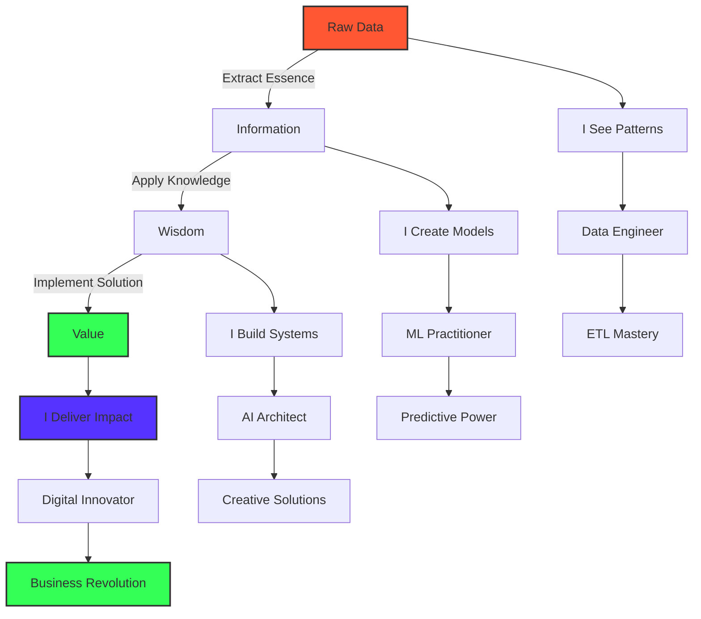

<div align="center">
  
</div>

<div align="center">
  <h3>
    <code>{ while(alive) { learn(); create(); share(); } }</code>
  </h3>
</div>

# ⚡ Forging Digital Intelligence From Raw Data Chaos ⚡

<div align="center">
  <a href="https://github.com/dheeraz07">
    
  </a>
</div>

[](https://www.linkedin.com/in/dheerazchavali/)
[](mailto:dheerazchavali@gmail.com)
[](https://leetcode.com/Dheeraz7/)
[](https://www.hackerrank.com/dheerazchavali)

## 🧙‍♂️ The Digital Alchemist's Manifesto

I don't just write code—I sculpt digital ecosystems where data flows like water, transforms like fire, and yields insights solid as earth. At the intersection of bits and neurons, I craft intelligent systems that blur the line between human intuition and machine precision.

```python
class Dheeraz(DataAlchemist):
    def __init__(self):
        self.mission = "Transmuting raw data into digital gold"
        self.powers = ["Pattern recognition", "System architecture", "AI conjuring"]
        self.motto = "In a world of 0s and 1s, I find the hidden 2s"
    
    def approach_problem(self, challenge):
        visualize_end_state(challenge)
        decode_underlying_patterns(challenge)
        architect_elegant_solution(challenge)
        implement_with_craftsmanship(challenge)
        return revolutionary_outcome(challenge)
    
    def daily_mantra(self):
        print("I don't predict the future. I build it.")
```

When data tsunamis overwhelm others, I'm building arks of algorithms. Where complexity creates chaos, I weave order through elegant architecture. I don't just follow the digital revolution—I'm engineering its next evolution.

<div align="center">
  
</div>

## 🔮 Where Imagination Meets Implementation

In my world, AI isn't just artificial intelligence—it's augmented imagination. Data pipelines aren't just workflows—they're digital nervous systems carrying the lifeblood of insights across the enterprise body.

I turn:
- 📊 Spreadsheet nightmares into dream dashboards that tell stories
- 🧩 Fragmented data sources into unified knowledge oceans
- 🤖 Static algorithms into learning entities that evolve with every byte
- 🌪️ Chaotic business problems into structured, solvable equations

<div align="center">
<h2>🧪 DIGITAL ELEMENTS TABLE 🧪</h2>
</div>

<div align="center" style="display: flex; flex-wrap: wrap; gap: 10px; justify-content: center;">

<div style="border-radius: 10px; padding: 15px; margin: 10px; background: linear-gradient(135deg, #232F3E 0%, #1A1A2E 100%);">
  
  <p><b>Py</b><br><small>36.5</small></p>
</div>

<table align="center">
  <tr>
    <!-- AI & LLMs Orbital -->
    <td>
      <div style="text-align: center; padding: 10px; background: radial-gradient(circle, #412991 0%, #301934 100%); border-radius: 50%; width: 120px; height: 120px;">
        
        
        
        <br>
        <span style="color: white; font-size: 12px;">AI & LLMs</span>
        <br>
        <span style="font-size: 10px; color: #ccc;">RAG • LlamaIndex • LangChain</span>
      </div>
    </td>
    
    <!-- Cloud Services Orbital -->
    <td>
      <div style="text-align: center; padding: 10px; background: radial-gradient(circle, #0078D4 0%, #003B6D 100%); border-radius: 50%; width: 120px; height: 120px;">
        
        
        
        <br>
        <span style="color: white; font-size: 12px;">Cloud Computing</span>
        <br>
        <span style="font-size: 10px; color: #ccc;">SageMaker • Lambda • EC2</span>
      </div>
    </td>
    
    <!-- Big Data Orbital -->
    <td>
      <div style="text-align: center; padding: 10px; background: radial-gradient(circle, #E25A1C 0%, #8A2100 100%); border-radius: 50%; width: 120px; height: 120px;">
        
        
        
        <br>
        <span style="color: white; font-size: 12px;">Big Data</span>
        <br>
        <span style="font-size: 10px; color: #ccc;">Spark • Hadoop • Kafka</span>
      </div>
    </td>
  </tr>
</table>

<!-- Neural Network Skill Visualization -->
<div style="margin-top: 20px; position: relative;">
  <svg width="800" height="400" viewBox="0 0 800 400" xmlns="http://www.w3.org/2000/svg">
    <!-- Background Pattern -->
    <defs>
      <pattern id="grid" width="40" height="40" patternUnits="userSpaceOnUse">
        <path d="M 40 0 L 0 0 0 40" fill="none" stroke="#1a1a1a" stroke-width="0.5"/>
      </pattern>
    </defs>
    <rect width="100%" height="100%" fill="url(#grid)" />
    
    <!-- Skill Nodes and Connections -->
    <!-- Each node represents a skill/tool, connections show relationships -->
  </svg>
  
  <!-- Skill Constellation -->
  <div style="position: absolute; top: 0; left: 0; width: 100%; height: 100%;">
    <!-- The skills are positioned as stars in a constellation -->
  </div>
</div>

<div style="display: flex; flex-wrap: wrap; justify-content: center; gap: 15px; margin-top: 20px;">
  <!-- AI & ML Tech -->
  <div style="background: linear-gradient(135deg, #8A2BE2 0%, #4B0082 100%); border-radius: 10px; padding: 15px; width: 180px; text-align: center;">
    <h3 style="margin: 0; color: white;">AI Alchemy</h3>
    <div style="margin: 10px 0;">
      
      
      
    </div>
    <div style="font-size: 10px; color: #ddd;">
      TensorFlow • PyTorch • Keras<br>
      LangChain • RAG • LlamaIndex<br>
      GPT • Vector Search
    </div>
  </div>
  
  <!-- Data Handling -->
  <div style="background: linear-gradient(135deg, #FF6F61 0%, #B22222 100%); border-radius: 10px; padding: 15px; width: 180px; text-align: center;">
    <h3 style="margin: 0; color: white;">Data Forge</h3>
    <div style="margin: 10px 0;">
      
      
      
    </div>
    <div style="font-size: 10px; color: #ddd;">
      Pandas • NumPy • Matplotlib<br>
      SQL • NoSQL • ETL<br>
      Data Pipelines • Airflow
    </div>
  </div>
  
  <!-- Cloud Services -->
  <div style="background: linear-gradient(135deg, #1E90FF 0%, #00008B 100%); border-radius: 10px; padding: 15px; width: 180px; text-align: center;">
    <h3 style="margin: 0; color: white;">Cloud Nexus</h3>
    <div style="margin: 10px 0;">
      
      
      
    </div>
    <div style="font-size: 10px; color: #ddd;">
      AWS • Azure • GCP<br>
      SageMaker • Lambda • EC2<br>
      S3 • Redshift • BigQuery
    </div>
  </div>
  
  <!-- Big Data Tech -->
  <div style="background: linear-gradient(135deg, #FF9900 0%, #FF4500 100%); border-radius: 10px; padding: 15px; width: 180px; text-align: center;">
    <h3 style="margin: 0; color: white;">Data Cosmos</h3>
    <div style="margin: 10px 0;">
      
      
      
    </div>
    <div style="font-size: 10px; color: #ddd;">
      Spark • Hadoop • Kafka<br>
      EMR • Databricks • Hive<br>
      Data Lakes • Streaming
    </div>
  </div>
</div>

<!-- Circular Skill Orbit -->
<div style="margin-top: 30px; position: relative; width: 100%; height: 300px;">
  <div style="position: absolute; top: 50%; left: 50%; transform: translate(-50%, -50%); text-align: center; z-index: 10; background: rgba(0,0,0,0.7); border-radius: 50%; width: 100px; height: 100px; display: flex; align-items: center; justify-content: center;">
    <div>
      <strong style="color: #0CE82B; font-size: 16px;">DATA</strong><br>
      <span style="color: white; font-size: 12px;">CORE</span>
    </div>
  </div>
  
  <!-- Inner Orbit: Data Science -->
  <div class="orbit" style="position: absolute; top: 50%; left: 50%; transform: translate(-50%, -50%); border: 1px dashed rgba(255,255,255,0.2); border-radius: 50%; width: 150px; height: 150px;"></div>
  
  <!-- Middle Orbit: ML/AI -->
  <div class="orbit" style="position: absolute; top: 50%; left: 50%; transform: translate(-50%, -50%); border: 1px dashed rgba(255,255,255,0.2); border-radius: 50%; width: 220px; height: 220px;"></div>
  
  <!-- Outer Orbit: Infrastructure -->
  <div class="orbit" style="position: absolute; top: 50%; left: 50%; transform: translate(-50%, -50%); border: 1px dashed rgba(255,255,255,0.2); border-radius: 50%; width: 290px; height: 290px;"></div>
  
  <!-- Skills positioned in orbital paths -->
  <!-- These would be positioned using sin/cos for circular placement -->
</div>

<!-- Tech Matrix Grid -->
<div style="display: grid; grid-template-columns: repeat(5, 1fr); gap: 10px; margin-top: 30px;">
  <!-- Programming Languages -->
  <div style="grid-column: span 2; background: linear-gradient(135deg, #333333 0%, #111111 100%); border-radius: 10px; padding: 15px; text-align: center;">
    <h4 style="margin: 0; color: #0CE82B;">SYNTAX</h4>
    <div style="display: flex; flex-wrap: wrap; justify-content: center; gap: 5px; margin-top: 10px;">
      <span style="background: #3776AB; color: white; padding: 5px 10px; border-radius: 15px; font-size: 12px;">Python</span>
      <span style="background: #FF7800; color: white; padding: 5px 10px; border-radius: 15px; font-size: 12px;">SQL</span>
      <span style="background: #00599C; color: white; padding: 5px 10px; border-radius: 15px; font-size: 12px;">C++</span>
      <span style="background: #F7DF1E; color: black; padding: 5px 10px; border-radius: 15px; font-size: 12px;">JavaScript</span>
      <span style="background: #B07219; color: white; padding: 5px 10px; border-radius: 15px; font-size: 12px;">Java</span>
    </div>
  </div>
  
  <!-- Big Data -->
  <div style="grid-column: span 3; background: linear-gradient(135deg, #E25A1C 0%, #8A2100 100%); border-radius: 10px; padding: 15px; text-align: center;">
    <h4 style="margin: 0; color: white;">DATA FLOW</h4>
    <div style="display: flex; flex-wrap: wrap; justify-content: center; gap: 5px; margin-top: 10px;">
      <span style="background: rgba(255,255,255,0.2); color: white; padding: 5px 10px; border-radius: 15px; font-size: 12px;">Spark</span>
      <span style="background: rgba(255,255,255,0.2); color: white; padding: 5px 10px; border-radius: 15px; font-size: 12px;">Kafka</span>
      <span style="background: rgba(255,255,255,0.2); color: white; padding: 5px 10px; border-radius: 15px; font-size: 12px;">Hadoop</span>
      <span style="background: rgba(255,255,255,0.2); color: white; padding: 5px 10px; border-radius: 15px; font-size: 12px;">Airflow</span>
      <span style="background: rgba(255,255,255,0.2); color: white; padding: 5px 10px; border-radius: 15px; font-size: 12px;">ETL</span>
      <span style="background: rgba(255,255,255,0.2); color: white; padding: 5px 10px; border-radius: 15px; font-size: 12px;">Databricks</span>
    </div>
  </div>
  
  <!-- ML/AI -->
  <div style="grid-column: span 3; background: linear-gradient(135deg, #8A2BE2 0%, #4B0082 100%); border-radius: 10px; padding: 15px; text-align: center;">
    <h4 style="margin: 0; color: white;">NEURAL NETWORKS</h4>
    <div style="display: flex; flex-wrap: wrap; justify-content: center; gap: 5px; margin-top: 10px;">
      <span style="background: rgba(255,255,255,0.2); color: white; padding: 5px 10px; border-radius: 15px; font-size: 12px;">TensorFlow</span>
      <span style="background: rgba(255,255,255,0.2); color: white; padding: 5px 10px; border-radius: 15px; font-size: 12px;">PyTorch</span>
      <span style="background: rgba(255,255,255,0.2); color: white; padding: 5px 10px; border-radius: 15px; font-size: 12px;">scikit-learn</span>
      <span style="background: rgba(255,255,255,0.2); color: white; padding: 5px 10px; border-radius: 15px; font-size: 12px;">LLMs</span>
      <span style="background: rgba(255,255,255,0.2); color: white; padding: 5px 10px; border-radius: 15px; font-size: 12px;">RAG</span>
      <span style="background: rgba(255,255,255,0.2); color: white; padding: 5px 10px; border-radius: 15px; font-size: 12px;">LangChain</span>
    </div>
  </div>
  
  <!-- Cloud -->
  <div style="grid-column: span 2; background: linear-gradient(135deg, #1E90FF 0%, #00008B 100%); border-radius: 10px; padding: 15px; text-align: center;">
    <h4 style="margin: 0; color: white;">CLOUD REALMS</h4>
    <div style="display: flex; flex-wrap: wrap; justify-content: center; gap: 5px; margin-top: 10px;">
      <span style="background: rgba(255,255,255,0.2); color: white; padding: 5px 10px; border-radius: 15px; font-size: 12px;">AWS</span>
      <span style="background: rgba(255,255,255,0.2); color: white; padding: 5px 10px; border-radius: 15px; font-size: 12px;">Azure</span>
      <span style="background: rgba(255,255,255,0.2); color: white; padding: 5px 10px; border-radius: 15px; font-size: 12px;">GCP</span>
      <span style="background: rgba(255,255,255,0.2); color: white; padding: 5px 10px; border-radius: 15px; font-size: 12px;">SageMaker</span>
      <span style="background: rgba(255,255,255,0.2); color: white; padding: 5px 10px; border-radius: 15px; font-size: 12px;">Lambda</span>
    </div>
  </div>
</div>

</div>

## 🧠 The Neural Architecture of Mastery



## 🚀 Chronicles of Digital Transformation

### [Finnhub Trading Data Streaming Pipeline](https://github.com/dheeraz07/Finnhub-trading-Data-Streaming-Pipeline)
Crafted a real-time neural system for financial markets that processes trading heartbeats through Kafka arteries and Spark neurons, transforming market noise into trading symphonies.

### [Anomaly Detection for Transactions and Network Logs](https://github.com/dheeraz07/Anomaly-Detection-in-Transactions-and-Netflow-logs)
Forged digital guardians that stand vigilant against the shadows of fraud and cyber threats, using advanced ML sentinels to distinguish normal patterns from malicious anomalies.

### [Amazon Connect Real-time Transcription](https://github.com/dheeraz07/Amazon-Connect-Real-time-Transcription)
Built digital ears that listen, understand, and translate human conversations into actionable text streams, giving voice to customer data through AWS's transcription alchemy.

### [Spotify Data Pipeline Using AWS](https://github.com/dheeraz07/Spotify-Data-Pipeline-Using-AWS)
Orchestrated a harmonious data symphony that captures the rhythm of music streaming, transforming scattered notes of user behavior into melodious insights.

### [Uber Expense Tracking with Apache Airflow](https://github.com/dheeraz07/Tracking-Uber-expenses-using-Apache-Airflow)
Conducted an automated financial concerto with Airflow as the maestro, directing the precise flow of expense data from raw receipts to visualization crescendos.

## ✨ The Code Whisperer's Stats

<div align="center">
  
  
</div>

## 🔥 Let's Conjure Digital Magic Together

I don't just solve problems—I hunt them with relentless curiosity. I don't just build systems—I craft digital cathedrals where data finds its highest purpose. If you seek a digital sorcerer who turns business challenges into technological marvels, let's connect and rewrite what's possible.

> "In the realm where data meets imagination, that's where you'll find me—crafting the impossible into reality, one algorithm at a time."

📬 Summon me: [dheerazchavali@gmail.com](mailto:dheerazchavali@gmail.com)