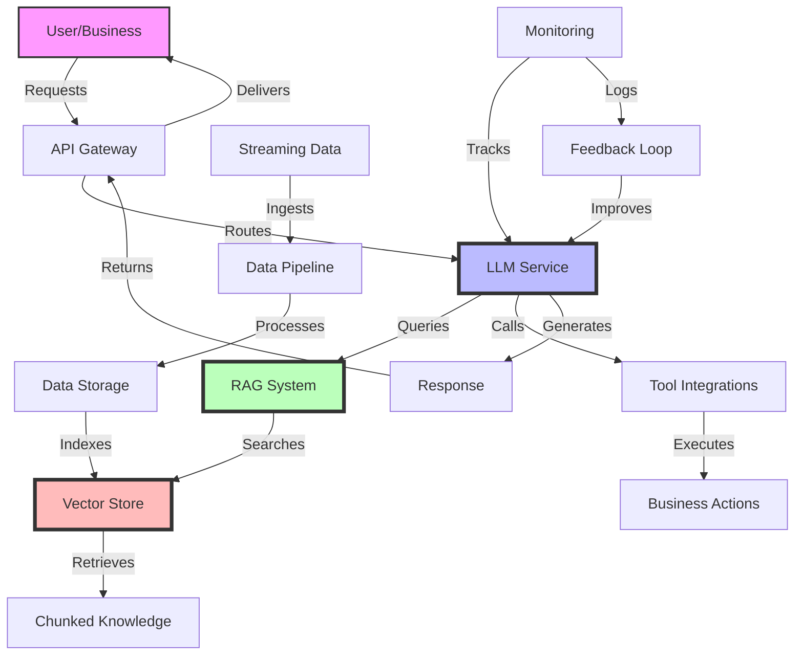
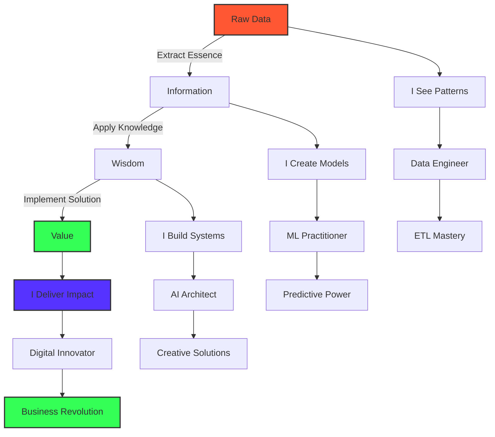

  

  

  <h3>
    <code>{ while(alive) { learn(); create(); share(); } }</code>
  </h3>

# ⚡ Forging Digital Intelligence From Raw Data Chaos ⚡

  

## 🔮 Where Imagination Meets Implementation

In my world, AI isn't just artificial intelligence—it's augmented imagination. Data pipelines aren't just workflows—they're digital nervous systems carrying the lifeblood of insights across the enterprise body.

I turn:
- 📊 Spreadsheet nightmares into dream dashboards that tell stories
- 🧩 Fragmented data sources into unified knowledge oceans
- 🤖 Static algorithms into learning entities that evolve with every byte
- 🌪️ Chaotic business problems into structured, solvable equations

  <h2>🌌 TECH MATRIX: 2024 SKILLVERSE 🌌</h2>

  <table border="0" cellspacing="0" cellpadding="0">
    <tr>
      <td align="center" width="33%">
        <h3>🧠 GEN AI ARCHITECT</h3>
        
        
        
        
        
        
Architecting next-gen AI solutions at the frontier of human-machine intelligence

      </td>
      <td align="center" width="33%">
        <h3>⚡ VECTOR DATABASE WIZARD</h3>
        
        
        
        
        
        
Mastering the embedding space where AI understanding happens at quantum speeds

      </td>
      <td align="center" width="33%">
        <h3>🌐 AI FRAMEWORK MAESTRO</h3>
        
        
        
        
        
        
Orchestrating AI ecosystems through sophisticated framework integration

      </td>
    </tr>
    <tr>
      <td align="center">
        <h3>🚀 ML/AI INFRASTRUCTURE</h3>
        
        
        
        
        
        
Building scalable foundations for AI systems with modern MLOps infrastructure

      </td>
      <td align="center">
        <h3>🔄 STREAMING SYSTEMS</h3>
        
        
        
        
        
        
Engineering real-time data highways for instantaneous intelligence and action

      </td>
      <td align="center">
        <h3>☁️ CLOUD NATIVE AI</h3>
        
        
        
        
        
        
Leveraging cloud platforms to deploy AI at planetary scale with minimal friction

      </td>
    </tr>
  </table>

  <h2>🔮 NEURAL ARCHITECTURE BLUEPRINT 🔮</h2>

  <table border="0" cellspacing="0" cellpadding="0" style="background: linear-gradient(to right, #000428, #004e92);">
    <tr>
      <td colspan="3" align="center">
        <h3>🧪 AI ALCHEMY LAB</h3>
      </td>
    </tr>
    <tr>
      <td align="center" width="33%">
        <h4>📊 DATA FOUNDATION</h4>
        

          <code>Python • NumPy • Pandas</code> 
          <code>SQL • ETL • OOP</code> 
          <code>DataOps • Data Pipelines</code>
        

      </td>
      <td align="center" width="33%">
        <h4>🔬 ANALYSIS CORE</h4>
        

          <code>Statistical Analysis</code> 
          <code>Hypothesis Testing</code> 
          <code>A/B Testing • EDA</code>
        

      </td>
      <td align="center" width="33%">
        <h4>📈 VISUALIZATION LENS</h4>
        

          <code>Matplotlib • Seaborn</code> 
          <code>Plotly • Tableau</code> 
          <code>D3.js • Data Storytelling</code>
        

      </td>
    </tr>
    <tr>
      <td colspan="3" align="center">
        <h3>🧠 INTELLIGENCE ENGINE</h3>
      </td>
    </tr>
    <tr>
      <td align="center">
        <h4>🔮 CLASSICAL ML</h4>
        

          <code>Scikit-learn • XGBoost</code> 
          <code>Feature Engineering</code> 
          <code>Model Evaluation</code>
        

      </td>
      <td align="center">
        <h4>🔥 DEEP LEARNING</h4>
        

          <code>TensorFlow • PyTorch</code> 
          <code>CNN • RNN • Transformers</code> 
          <code>Neural Architecture</code>
        

      </td>
      <td align="center">
        <h4>🚀 GENERATIVE AI</h4>
        

          <code>LLMs • RAG • Fine-tuning</code> 
          <code>Embedding Models</code> 
          <code>Multimodal Systems</code>
        

      </td>
    </tr>
    <tr>
      <td colspan="3" align="center">
        <h3>⚙️ DEPLOYMENT INFRASTRUCTURE</h3>
      </td>
    </tr>
    <tr>
      <td align="center">
        <h4>☁️ CLOUD REALMS</h4>
        

          <code>AWS • Azure • GCP</code> 
          <code>Serverless • Containers</code> 
          <code>Cloud Architecture</code>
        

      </td>
      <td align="center">
        <h4>⚡ BIG DATA</h4>
        

          <code>Spark • Hadoop • Kafka</code> 
          <code>Data Lakes • Streaming</code> 
          <code>Distributed Systems</code>
        

      </td>
      <td align="center">
        <h4>🔄 MLOPS</h4>
        

          <code>CI/CD for ML • Monitoring</code> 
          <code>Model Versioning • A/B Testing</code> 
          <code>Feature Stores • MLflow</code>
        

      </td>
    </tr>
  </table>

  <h2>🌐 AI ENGINEERING SPECTRUM 🌐</h2>

  

     
    
    
    
    
    
  

  

     
    
    
    
    
    
  

  

     
    
    
    
    
    
  

  

     
    
    
    
    
    
  

  

     
    
    
    
    
    
  

  

     
    
    
    
    
    
  

  

     
    
    
    
    
    
  

  <h2>🧩 AI SYSTEM ARCHITECTURE 🧩</h2>
  
How I connect everything in the modern AI stack

## 🧠 The Neural Architecture of Mastery

## 🧙‍♂️ The Digital Alchemist's Manifesto

  

  <h3 style="color: #00E1FF; margin-bottom: 15px;">⚡ THE TECHNO-PHILOSOPHER'S STONE ⚡</h3>
  
  

    In the digital cosmos where most perceive only chaos, I discern the hidden mathematical poetry. I am neither merely a developer nor simply an analyst - I am a frontier explorer at the intersection of data dimensionality and human understanding.
  

Every innovation begins with a question: _"What if...?"_

I dwell in this realm of possibilities, where binary becomes ternary, where rigid algorithms transform into adaptable intelligence, where the boundary between human creativity and machine capability becomes increasingly indistinguishable.

> "Some see data as the new oil. I see it as the new atmosphere - invisible yet all-encompassing, waiting to be transformed into the very breath of digital life."

### 🌌 My Fundamental Principles

1. **Dimensional Thinking** - While others see flat data points, I navigate hyperdimensional information spaces where patterns emerge like constellations
2. **Quantum Leaps** - I don't incrementally improve; I reimagine systems from first principles, creating order-of-magnitude advances
3. **Elegant Complexity** - My solutions embrace the intrinsic complexity of real-world challenges while offering interfaces of startling simplicity
4. **Algorithmic Empathy** - I build systems that understand not just what users ask for, but what they truly need
5. **Technological Foresight** - I don't chase trends; I anticipate the technological horizons before they materialize

In the age of commoditized machine learning, I craft bespoke intelligence – systems that don't merely predict the future but help create it.

I don't merely exist at the convergence of machine intelligence and human creativity – I actively expand this frontier, transmuting the lead of raw data into the gold of actionable wisdom that drives exponential value.

  <h4>FROM COMPLEXITY → CLARITY → CAPABILITY → TRANSFORMATION</h4>

This is not just what I do. This is who I am.

When data tsunamis overwhelm others, I'm building arks of algorithms. Where complexity creates chaos, I weave order through elegant architecture. I don't just follow the digital revolution—I'm engineering its next evolution.

<!-- Snake Animation -->
<picture>
  <source media="(prefers-color-scheme: dark)" srcset="https://raw.githubusercontent.com/dheeraz07/dheeraz07/output/github-snake-dark.svg" />
  <source media="(prefers-color-scheme: light)" srcset="https://raw.githubusercontent.com/dheeraz07/dheeraz07/output/github-snake.svg" />
  
</picture>

  

## ✨ The Code Whisperer's Stats

  
  

## 🔥 Let's Conjure Digital Magic Together

I don't just solve problems—I hunt them with relentless curiosity. I don't just build systems—I craft digital cathedrals where data finds its highest purpose. If you seek a digital sorcerer who turns business challenges into technological marvels, let's connect and rewrite what's possible.

> "In the realm where data meets imagination, that's where you'll find me—crafting the impossible into reality, one algorithm at a time."

📬 Summon me: [dheerazchavali@gmail.com](mailto:dheerazchavali@gmail.com)
